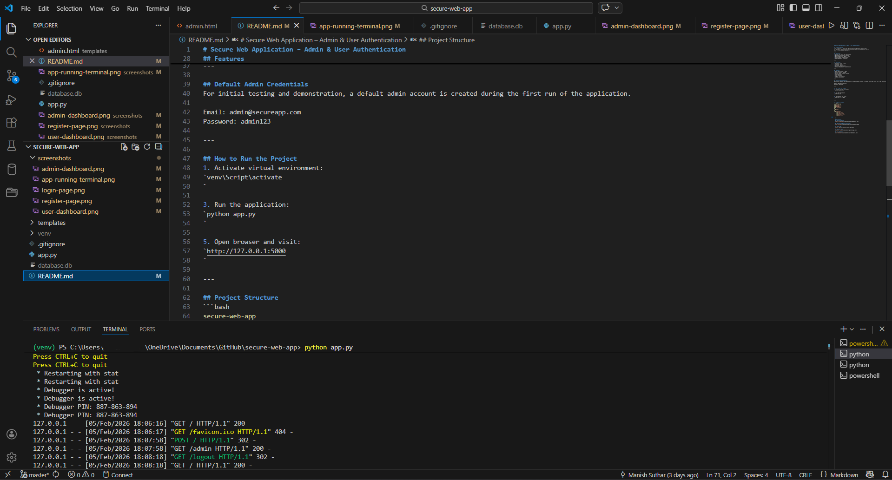
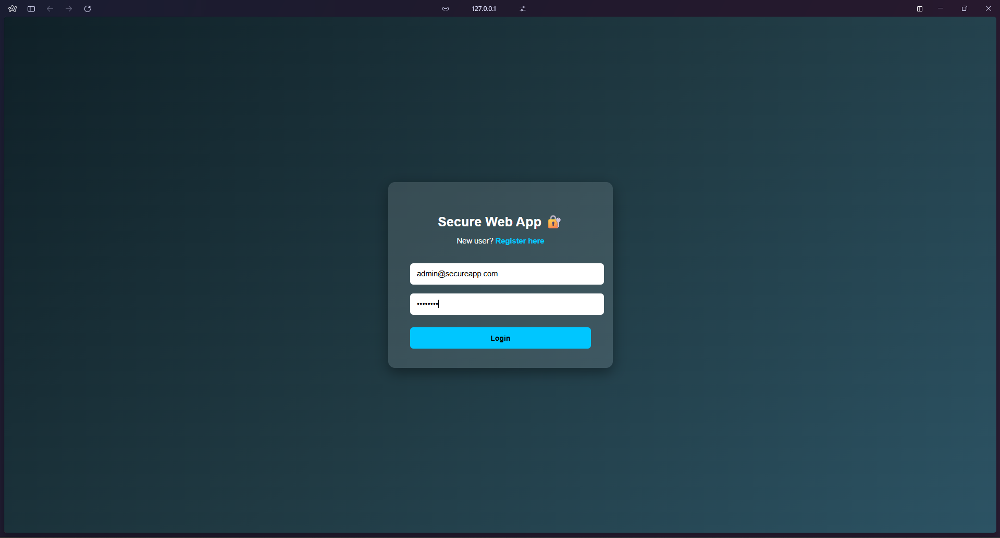
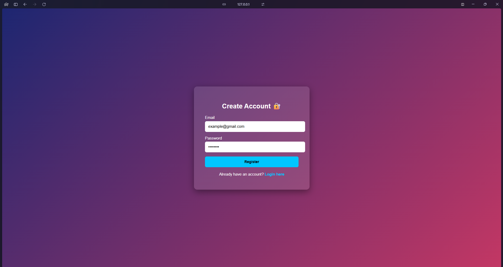
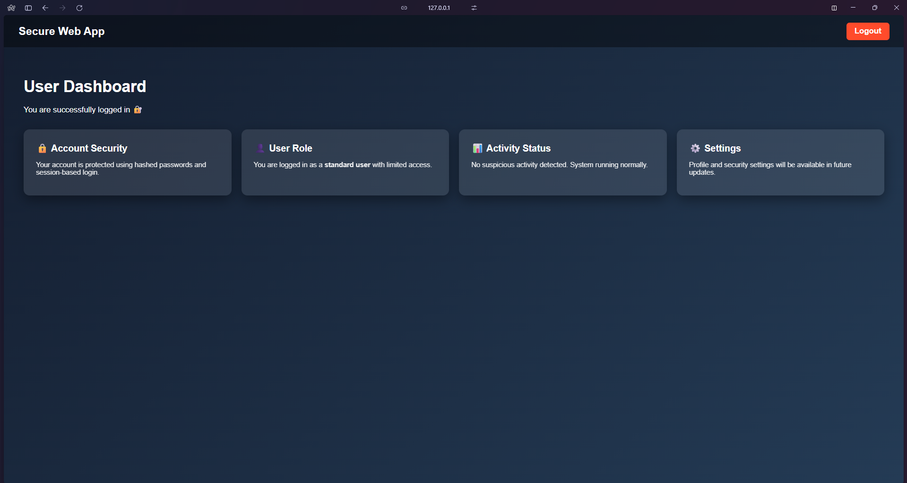

# Secure Web Application – Admin & User Authentication
### Project Overview

Secure Web Application is a role-based authentication system developed using Python Flask.
This project focuses on web security fundamentals, including secure login, password hashing, session management, and protected admin access.

This project was developed as part of an internship skill development program under Team Cryptonic Area 🔐, with the objective of learning real-world backend security implementation and best practices.
---

## Objectives

- Secure user login and registration

- Password hashing using bcrypt

- Role-based access control (Admin / User)

- Session-based authentication

- Protection of sensitive routes

- Secure admin dashboard access

----

## Tech Stack

- **Backend:** Python (Flask)

- **Frontend:** HTML, CSS

- **Database:** SQLite

- **Security:** Flask-Bcrypt

- **Authentication:** Session-based login

----

## Features

- User Registration & Login

- Secure password hashing

- Default admin account creation

- Role-based dashboards (Admin / User)

- Session-protected routes

- Logout functionality

- Clean and professional UI

----

## 👤 Default Admin Credentials

#### For testing and demonstration purposes, a default admin account is created automatically during the first run.

**Email:** admin@secureapp.com

**Password:** admin123

**Note:** These credentials should be changed in production environments.

----

## How to Run the Project
### Change  project directory:
```bash
cd secure-web-app
```
#### Create and activate virtual environment
```bash
python -m venv venv
venv\Scripts\activate
```

#### Install required dependencies
```bash
pip install flask flask-bcrypt
```

#### Run the application
```bash
python app.py
```

#### Open browser and visit
http://127.0.0.1:5000

----

## Project Workflow
```bash
User
 ↓
Login / Register Page
 ↓
Flask Backend
 ↓
Password Hash Check (bcrypt)
 ↓
Session Created
 ↓
Role Verification
 ↓
Admin Dashboard / User Dashboard
```

----

## 📚 What I Learned

- How authentication works in real web applications

- Importance of password hashing over plain text storage

- Role-based access control implementation

- Session management and route protection

- Secure backend design using Flask

- Professional GitHub repository structuring

- Writing clear and meaningful documentation

----

## Internship Details

- Built During: Internship / Skill Development Program

- Organization: **Cryptonic Area** 

- Domain: Cybersecurity & Ethical Hacking

----

## 📁 Project Structure
```bash
secure-web-app
│── app.py
│── database.db
│── README.md
│── .gitignore
│
├── venv/
│
└── templates/
    ├── login.html
    ├── register.html
    ├── dashboard.html
    └── admin.html
```

 ## Screenshots
 ### Admin Dashboard
 

 ### Application Running (Terminal)
 

 ### Login Page
 

 ### Register Page
 

 ### User Dashboard
 
